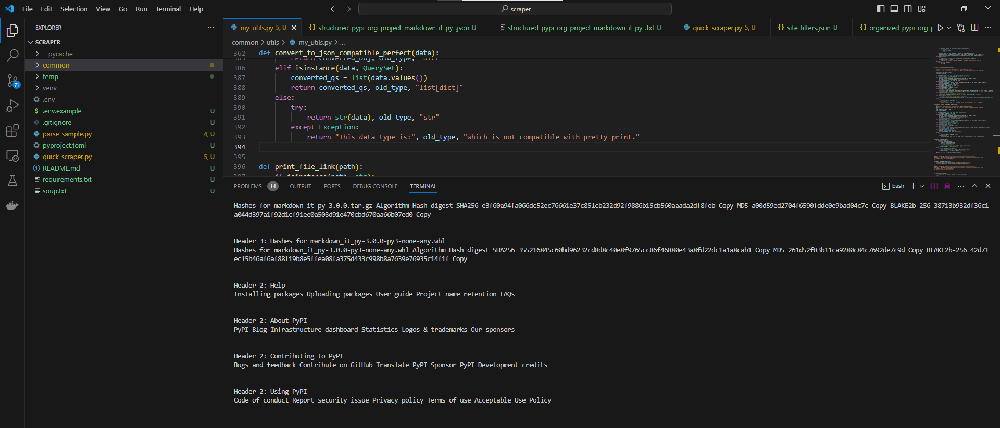

## Project Summary

This is a 'quick scraper' that is designed to do a fast scrape and return very clean content in two formats: Clean Text and a highly structured JSON.

# Clean Content
- Purpose: The purpose of this is to very quickly get clean content from the body of any website so that it can be fed to an AI agent or chatbot.
- Important: Chatbots cannot handle too much data so any content that is from the sidebar, the header, the footer, or parts of the page that don't truly add value will massively hurt performance.
- Structure: While the purpose of this is to return clean text, it's essential that we maintain the structure of the page, especially when it comes to H1, H2, H3, H4, lists, and tables.

# Structured JSON
- Purpose: The purpose of this is to return a highly structured JSON that can be used for data analysis, data science, or machine learning, but more importantly, to send only SOME data to a chatbot.
- Important: Properly capturing all lists, tables, headers, markdown content, and other relevant data in a highly structured and organized way is critical.
- Structure: The nesting of the JSON is critical because we will sometimes send a list of all keys to a specialized AI Agent and ask her to tell us what she wants back in detail. (This labeling is critical)

# Current Implementation Notes:
1. The current setup was just my "test code" so it's not clean and it's definitely not optimized. Most of the features don't work.
2. The first script (quick_scraper) does a scrape and also does a parse. (This was my first attempt at creating what I wanted) - Some parts were never set up.
3. The second script (parse_sample) does an incredible job of parsing some websites, but for other sites, it fails terribly.
   - You will see that I attempted to resolve this by incorporating site-specific logic and a few other things, but I ran out of time.

There is a lot of code that is totally unused or code that needs a little bit of work and it will be amazing, but I just haven't had time to work on it.

If you are working on this project, remember that the goal is to very quickly get really clean content from a page and feed it to a chatbot, but get the highly structured content as well. 

[](https://www.loom.com/share/3648ee5b292c46aea82383ad72254f7c)

---

## Running this project

**python == 3.12.0**
python = "^3.12,<3.13"

To get this project up and running you should start by having Python installed on your computer. It's advised you create a virtual environment to store your projects dependencies separately. You can install virtualenv with

```
python -m venv venv
```

Clone or download this repository and open it in your editor of choice. In a terminal (mac/linux) or windows terminal, run the following command in the base directory of this project

```
python -m venv venv
```

That will create a new folder `venv` in your project directory. Next activate it with this command on mac/linux:

```
source venv/bin/active
```

Then install the project dependencies with

```
pip install -r requirements.txt
```

Now you can run the project with this command

```
python manage.py quick_scraper.py
```

**Note** Repalcae `.env.example` file to `.env`.
And then change base directory to current project working directory

---

You can poetry either. Be sure to include added package to poetry 
